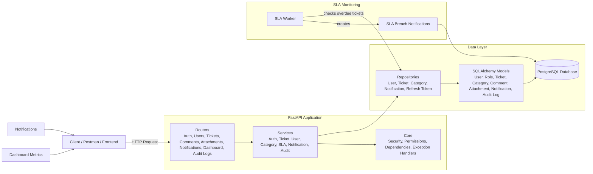

# Architecture Diagram

```mermaid
flowchart LR
    Client[Client / Postman / Frontend]

    subgraph API[FastAPI Application]
        Routes[Routers\nAuth, Users, Tickets, Comments, Attachments, Notifications, Dashboard, Audit Logs]
        Services[Services\nAuth, Ticket, User, Category, SLA, Notification, Audit]
        Core[Core\nSecurity, Permissions, Dependencies, Exception Handlers]
    end

    subgraph Data[Data Layer]
        Repos[Repositories\nUser, Ticket, Category, Notification, Refresh Token]
        Models[SQLAlchemy Models\nUser, Role, Ticket, Category, Comment, Attachment, Notification, Audit Log]
        DB[(PostgreSQL Database)]
    end

    subgraph Background[SLA Monitoring]
        Worker[SLA Worker]
        Breach[SLA Breach Notifications]
    end

    Client -->|HTTP Request| Routes
    Routes --> Services
    Services --> Repos
    Repos --> Models
    Models --> DB

    Services --> Core
    Worker -->|checks overdue tickets| Repos
    Worker -->|creates| Breach
    Breach --> DB

    Notifications[Notifications] --> Client
    Dashboard[Dashboard Metrics] --> Client
```

