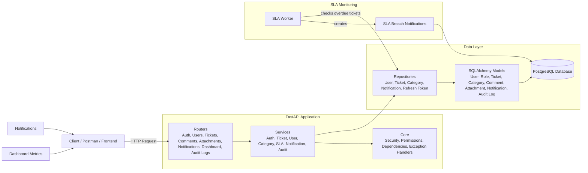
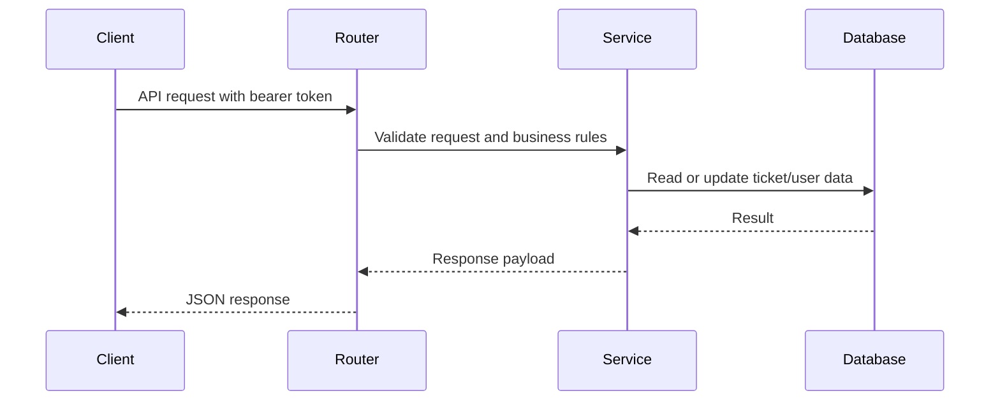

# Architecture Diagram

## Architecture overview

The backend follows a layered architecture:

1. Client layer
   - Frontend app, Postman, or API consumers.

2. API layer
   - FastAPI routers expose endpoints grouped by domain.

3. Service layer
   - Business logic for authentication, ticket workflows, notifications, SLA checks, and user management.

4. Repository/data layer
   - SQLAlchemy repositories interact with database models.

5. Persistence layer
   - PostgreSQL stores users, roles, tickets, categories, comments, attachments, notifications, and audit records.

6. Background processing layer
   - SLA worker checks overdue tickets and creates breach notifications on a scheduled interval.

## Request flow example

This shows the standard flow used across the project: request → router → service → database → return response.
