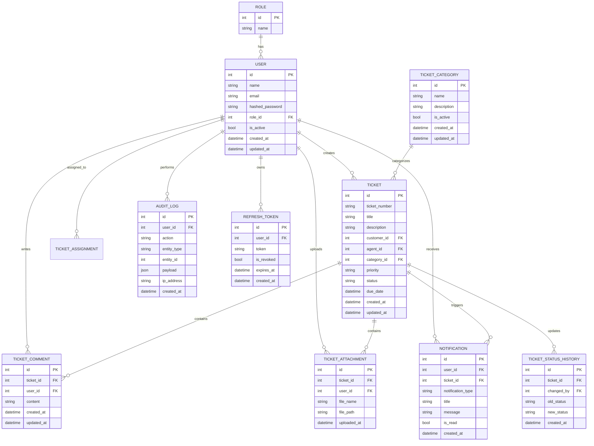

# ER Diagram

## Entity description

- Users belong to a role and can act as customers, support agents, or admins.
- A ticket belongs to one customer, may be assigned to one agent, and belongs to one category.
- A ticket can have many comments, attachments, notifications, and status history entries.
- Notifications are sent to users related to ticket activity and SLA breaches.
- Audit logs track important actions for security and traceability.
- Refresh tokens are stored per user so sessions can be revoked safely.
