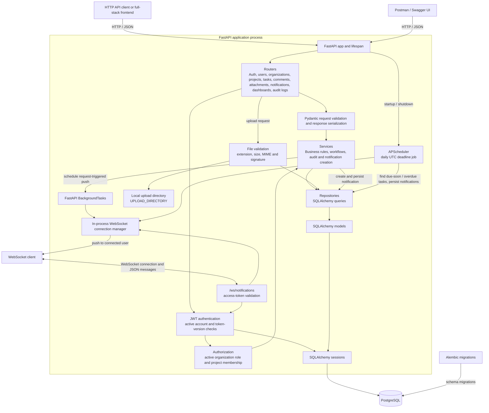

# System Architecture

This document describes the architecture implemented in the repository. The application is a backend-only FastAPI service.

## Component diagram

```mermaid
flowchart TB
    Client["HTTP API client or full-stack frontend"]
    WSClient["WebSocket client"]
    Postman["Postman / Swagger UI"]

    subgraph APIProcess["FastAPI application process"]
        App["FastAPI app and lifespan"]
        Routers["Routers\nAuth, users, organizations, projects, tasks, comments, attachments, notifications, dashboards, audit logs"]
        Schemas["Pydantic request validation and response serialization"]
        Auth["JWT authentication\nactive account and token-version checks"]
        RBAC["Authorization\nactive organization role and project membership"]
        Services["Services\nBusiness rules, workflows, audit and notification creation"]
        Repositories["Repositories\nSQLAlchemy queries"]
        Models["SQLAlchemy models"]
        DBSession["SQLAlchemy sessions"]
        UploadValidator["File validation\nextension, size, MIME and signature"]
        UploadStorage["Local upload directory\nUPLOAD_DIRECTORY"]
        FastAPITasks["FastAPI BackgroundTasks"]
        APScheduler["APScheduler\ndaily UTC deadline job"]
        WSRoute["/ws/notifications\naccess-token validation"]
        WSManager["In-process WebSocket connection manager"]
    end

    PostgreSQL[("PostgreSQL")]
    Alembic["Alembic migrations"]

    Client -->|"HTTP / JSON"| App
    Postman -->|"HTTP / JSON"| App
    App --> Routers
    Routers --> Schemas
    Routers --> Auth
    Auth --> DBSession
    Auth --> RBAC
    RBAC --> Services
    Schemas --> Services
    Services --> Repositories
    Repositories --> Models
    Models --> DBSession
    DBSession --> PostgreSQL

    Routers -->|"upload request"| UploadValidator
    UploadValidator --> UploadStorage
    UploadValidator --> Repositories

    Services -->|"create and persist notification"| Repositories
    Services -->|"schedule request-triggered push"| FastAPITasks
    FastAPITasks --> WSManager
    App -->|"startup / shutdown"| APScheduler
    APScheduler -->|"find due-soon / overdue tasks, persist notifications"| Repositories
    APScheduler --> WSManager

    WSClient <-->|"WebSocket connection and JSON messages"| WSRoute
    WSRoute --> Auth
    WSRoute --> WSManager
    WSManager -->|"push to connected user"| WSClient

    Alembic -->|"schema migrations"| PostgreSQL
```

