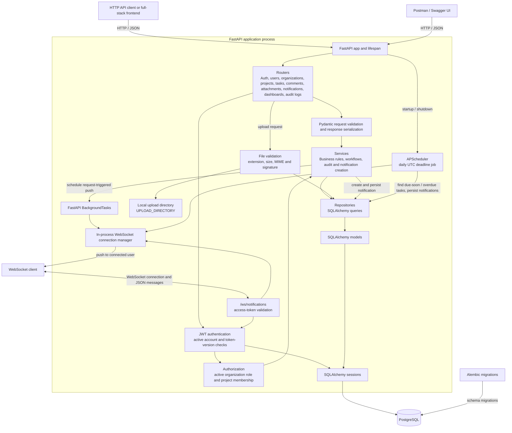

# System Architecture

This document describes the architecture implemented in the repository. The application is a backend-only FastAPI service.

## Component diagram

## Request flow

1. An API client sends an HTTP request to a FastAPI router. Pydantic schemas validate request data and serialize responses.
2. Protected routes use the JWT dependency to validate the access token, active user, and token version.
3. Authorization checks use the user's active organization role and project membership, with the global Super Admin as the platform-wide override.
4. Routers call services for business rules. Services call repositories, which use SQLAlchemy models and sessions to read or write PostgreSQL.
5. Audit records and persistent notifications are written to PostgreSQL as part of the relevant business operation.

## Notifications and files

- Request-triggered notification pushes are scheduled with FastAPI `BackgroundTasks` and sent through the in-process WebSocket manager. Notification records are also stored in PostgreSQL and can be retrieved through REST endpoints.
- An APScheduler job starts with the FastAPI lifespan and checks for due-soon and overdue tasks daily in UTC. It stores notifications and pushes them to connected users. PostgreSQL advisory locking prevents overlapping runs in multi-worker deployments.
- WebSocket connections are held in process memory. In a multi-worker deployment, a shared pub/sub service would be needed to route pushes between workers.
- Uploaded files are validated by extension, size, MIME type, and supported file signatures, then written to the configured local upload directory. Attachment metadata is stored in PostgreSQL.

## Schema and infrastructure

- Alembic applies database schema migrations; application startup does not create production tables.
- PostgreSQL stores application records, membership relationships, audit history, notification history, and refresh-token records.
- FastAPI `BackgroundTasks` and APScheduler are used; this project does not include Celery, Redis, or a separate task-worker service.
- No frontend is included. A frontend or WebSocket client must render incoming notification messages for end users.
