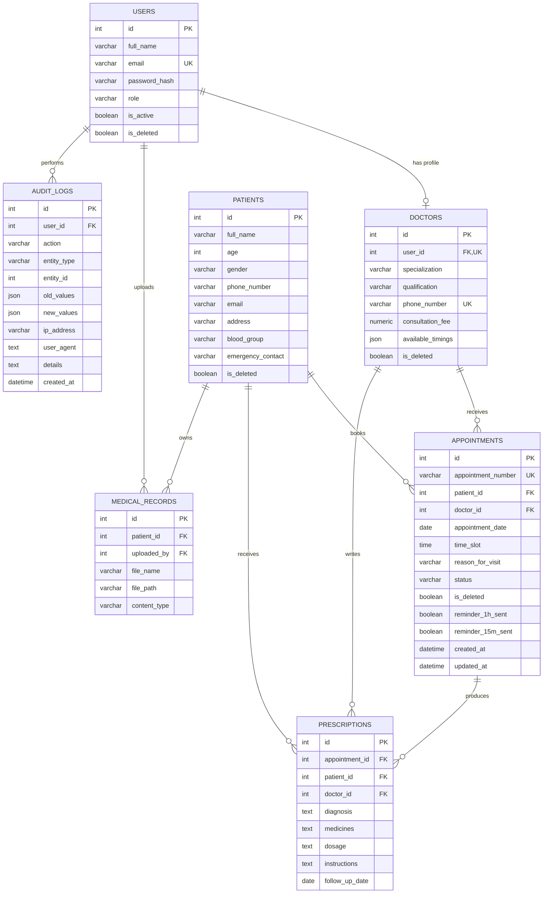

# Database Schema

T

```mermaid
erDiagram
    USERS ||--o| DOCTORS : "has profile"
    USERS ||--o{ MEDICAL_RECORDS : uploads
    USERS ||--o{ AUDIT_LOGS : performs
    DOCTORS ||--o{ APPOINTMENTS : receives
    PATIENTS ||--o{ APPOINTMENTS : books
    APPOINTMENTS ||--o{ PRESCRIPTIONS : produces
    PATIENTS ||--o{ PRESCRIPTIONS : receives
    DOCTORS ||--o{ PRESCRIPTIONS : writes
    PATIENTS ||--o{ MEDICAL_RECORDS : owns

    USERS {
        int id PK
        varchar full_name
        varchar email UK
        varchar password_hash
        varchar role
        boolean is_active
        boolean is_deleted
    }

    DOCTORS {
        int id PK
        int user_id FK,UK
        varchar specialization
        varchar qualification
        varchar phone_number UK
        numeric consultation_fee
        json available_timings
        boolean is_deleted
    }

    PATIENTS {
        int id PK
        varchar full_name
        int age
        varchar gender
        varchar phone_number
        varchar email
        varchar address
        varchar blood_group
        varchar emergency_contact
        boolean is_deleted
    }

    APPOINTMENTS {
        int id PK
        varchar appointment_number UK
        int patient_id FK
        int doctor_id FK
        date appointment_date
        time time_slot
        varchar reason_for_visit
        varchar status
        boolean is_deleted
        boolean reminder_1h_sent
        boolean reminder_15m_sent
        datetime created_at
        datetime updated_at
    }

    PRESCRIPTIONS {
        int id PK
        int appointment_id FK
        int patient_id FK
        int doctor_id FK
        text diagnosis
        text medicines
        text dosage
        text instructions
        date follow_up_date
    }

    MEDICAL_RECORDS {
        int id PK
        int patient_id FK
        int uploaded_by FK
        varchar file_name
        varchar file_path
        varchar content_type
    }

    AUDIT_LOGS {
        int id PK
        int user_id FK
        varchar action
        varchar entity_type
        int entity_id
        json old_values
        json new_values
        varchar ip_address
        text user_agent
        text details
        datetime created_at
    }
```

