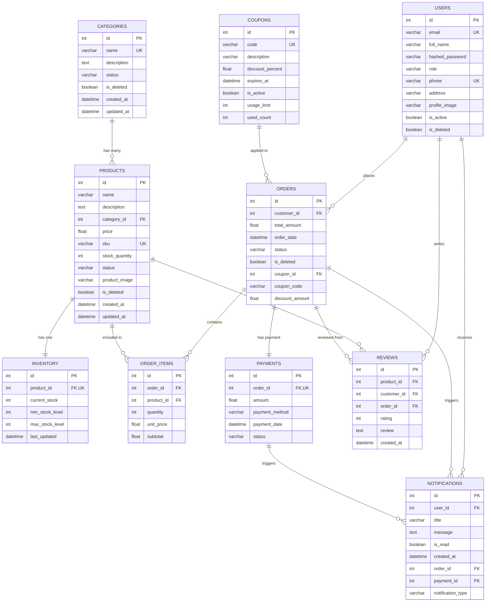

# Database Schema Diagram

```mermaid
erDiagram
    USERS {
        int id PK
        varchar email UK
        varchar full_name
        varchar hashed_password
        varchar role
        varchar phone UK
        varchar address
        varchar profile_image
        boolean is_active
        boolean is_deleted
    }

    CATEGORIES {
        int id PK
        varchar name UK
        text description
        varchar status
        boolean is_deleted
        datetime created_at
        datetime updated_at
    }

    PRODUCTS {
        int id PK
        varchar name
        text description
        int category_id FK
        float price
        varchar sku UK
        int stock_quantity
        varchar status
        varchar product_image
        boolean is_deleted
        datetime created_at
        datetime updated_at
    }

    INVENTORY {
        int id PK
        int product_id FK,UK
        int current_stock
        int min_stock_level
        int max_stock_level
        datetime last_updated
    }

    COUPONS {
        int id PK
        varchar code UK
        varchar description
        float discount_percent
        datetime expires_at
        boolean is_active
        int usage_limit
        int used_count
    }

    ORDERS {
        int id PK
        int customer_id FK
        float total_amount
        datetime order_date
        varchar status
        boolean is_deleted
        int coupon_id FK
        varchar coupon_code
        float discount_amount
    }

    ORDER_ITEMS {
        int id PK
        int order_id FK
        int product_id FK
        int quantity
        float unit_price
        float subtotal
    }

    PAYMENTS {
        int id PK
        int order_id FK,UK
        float amount
        varchar payment_method
        datetime payment_date
        varchar status
    }

    REVIEWS {
        int id PK
        int product_id FK
        int customer_id FK
        int order_id FK
        int rating
        text review
        datetime created_at
    }

    NOTIFICATIONS {
        int id PK
        int user_id FK
        varchar title
        text message
        boolean is_read
        datetime created_at
        int order_id FK
        int payment_id FK
        varchar notification_type
    }

    %% Relationships
    CATEGORIES ||--o{ PRODUCTS : "has many"
    PRODUCTS ||--|| INVENTORY : "has one"
    USERS ||--o{ ORDERS : "places"
    ORDERS ||--o{ ORDER_ITEMS : "contains"
    PRODUCTS ||--o{ ORDER_ITEMS : "included in"
    ORDERS ||--|| PAYMENTS : "has payment"
    COUPONS ||--o{ ORDERS : "applied to"
    USERS ||--o{ REVIEWS : "writes"
    PRODUCTS ||--o{ REVIEWS : "receives"
    ORDERS ||--o{ REVIEWS : "reviewed from"
    USERS ||--o{ NOTIFICATIONS : "receives"
    ORDERS ||--o{ NOTIFICATIONS : "triggers"
    PAYMENTS ||--o{ NOTIFICATIONS : "triggers"
```

