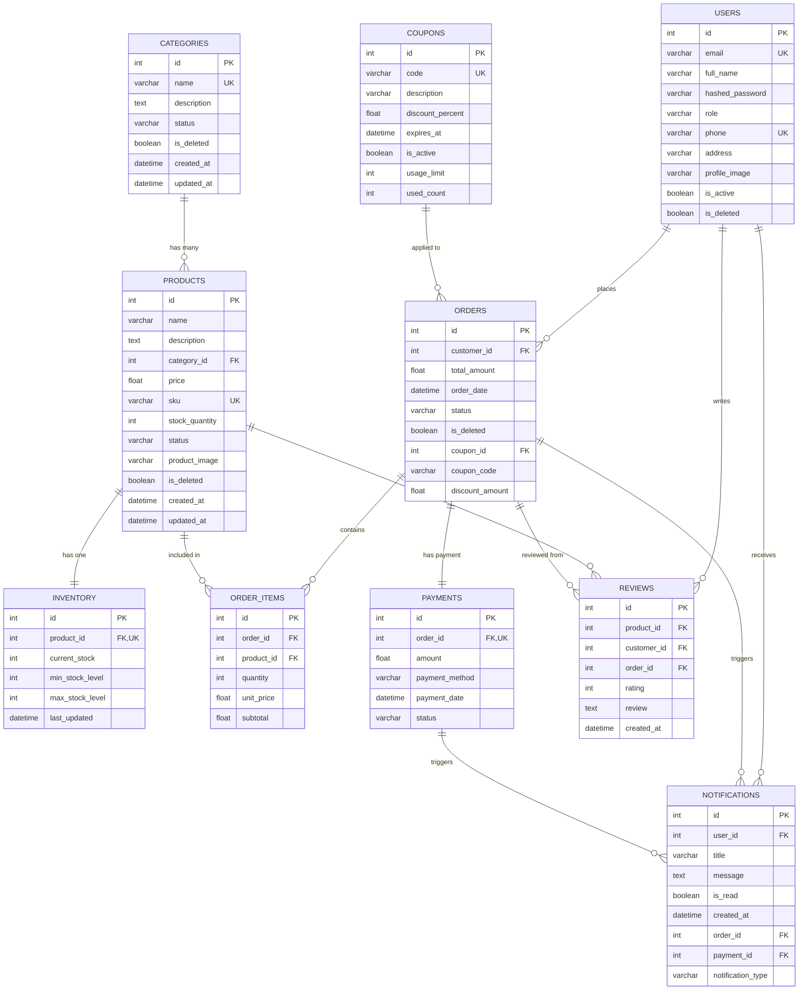

# Database Schema Diagram

## Overview
This diagram represents the complete database schema for the Inventory & Order Management System, showing all tables, columns, data types, constraints, and relationships.

## Entity Relationship Diagram

## Table Details

### USERS Table
- **Purpose**: Store user account information for customers, staff, and administrators
- **Key Constraints**:
  - Primary Key: `id`
  - Unique Keys: `email`, `phone`
  - Default role: "Customer"
- **Relationships**:
  - One-to-Many with Orders (as customer)
  - One-to-Many with Reviews (as customer)
  - One-to-Many with Notifications

### CATEGORIES Table
- **Purpose**: Product categorization and organization
- **Key Constraints**:
  - Primary Key: `id`
  - Unique Key: `name`
  - Unique constraint: `uq_category_name`
- **Relationships**:
  - One-to-Many with Products

### PRODUCTS Table
- **Purpose**: Store product information and catalog management
- **Key Constraints**:
  - Primary Key: `id`
  - Foreign Key: `category_id` → Categories
  - Unique Key: `sku`
- **Relationships**:
  - Many-to-One with Categories
  - One-to-One with Inventory
  - One-to-Many with Order Items
  - One-to-Many with Reviews

### INVENTORY Table
- **Purpose**: Track stock levels and inventory management
- **Key Constraints**:
  - Primary Key: `id`
  - Foreign Key: `product_id` → Products (Unique)
  - One-to-one relationship with Products
- **Business Rules**:
  - `current_stock` cannot be negative
  - `min_stock_level` triggers low stock alerts
  - `max_stock_level` defines maximum capacity

### COUPONS Table
- **Purpose**: Manage discount coupons and promotional codes
- **Key Constraints**:
  - Primary Key: `id`
  - Unique Key: `code`
- **Business Rules**:
  - `discount_percent` range: 0-100%
  - `usage_limit` controls maximum usage
  - `used_count` tracks actual usage
  - Automatic deactivation when limit reached

### ORDERS Table
- **Purpose**: Store customer order information and status
- **Key Constraints**:
  - Primary Key: `id`
  - Foreign Key: `customer_id` → Users
  - Foreign Key: `coupon_id` → Coupons (optional)
- **Status Values**: Pending, Confirmed, Shipped, Delivered, Cancelled
- **Relationships**:
  - Many-to-One with Users (customer)
  - One-to-Many with Order Items
  - One-to-One with Payment
  - Many-to-One with Coupons (optional)

### ORDER_ITEMS Table
- **Purpose**: Store individual items within each order
- **Key Constraints**:
  - Primary Key: `id`
  - Foreign Key: `order_id` → Orders
  - Foreign Key: `product_id` → Products
- **Business Rules**:
  - `subtotal` = `quantity` × `unit_price`
  - Stock validation on order creation

### PAYMENTS Table
- **Purpose**: Track payment transactions and status
- **Key Constraints**:
  - Primary Key: `id`
  - Foreign Key: `order_id` → Orders (Unique)
  - One-to-one relationship with Orders
- **Status Values**: Pending, Completed, Failed, Refunded
- **Business Rules**:
  - One payment per order maximum
  - Amount must match order total

### REVIEWS Table
- **Purpose**: Store customer product reviews and ratings
- **Key Constraints**:
  - Primary Key: `id`
  - Foreign Keys: `product_id`, `customer_id`, `order_id`
  - Unique constraint: One review per product per customer per order
- **Business Rules**:
  - Rating range: 1-5 stars
  - Only customers with delivered orders can review
  - Customer can update/delete their own reviews

### NOTIFICATIONS Table
- **Purpose**: Store system notifications for users
- **Key Constraints**:
  - Primary Key: `id`
  - Foreign Key: `user_id` → Users
  - Foreign Key: `order_id` → Orders (optional)
  - Foreign Key: `payment_id` → Payments (optional)
- **Notification Types**:
  - Order events (created, confirmed, shipped, delivered, cancelled)
  - Payment events (completed, refunded)
  - Stock alerts (low stock)

## Database Constraints Summary

### Primary Keys
- All tables have auto-incrementing integer primary keys

### Foreign Key Constraints
- `products.category_id` → `categories.id`
- `inventory.product_id` → `products.id` (Unique)
- `orders.customer_id` → `users.id`
- `orders.coupon_id` → `coupons.id`
- `order_items.order_id` → `orders.id`
- `order_items.product_id` → `products.id`
- `payments.order_id` → `orders.id` (Unique)
- `reviews.product_id` → `products.id`
- `reviews.customer_id` → `users.id`
- `reviews.order_id` → `orders.id`
- `notifications.user_id` → `users.id`
- `notifications.order_id` → `orders.id`
- `notifications.payment_id` → `payments.id`

### Unique Constraints
- `users.email`, `users.phone`
- `categories.name`
- `products.sku`
- `inventory.product_id`
- `coupons.code`
- `payments.order_id`
- `reviews(product_id, customer_id, order_id)`

### Indexes
- Primary key indexes (automatic)
- Foreign key indexes for performance
- Unique constraint indexes
- Additional indexes on frequently queried columns

## Business Logic Constraints

### Stock Management
- Stock levels cannot go negative
- Automatic stock adjustment on order confirmation
- Low stock notifications when below minimum threshold
- Real-time inventory updates

### Order Processing
- Status flow validation: Pending → Confirmed → Shipped → Delivered
- Stock validation before order confirmation
- Automatic total calculation (no client manipulation)
- Coupon validation and discount application

### Payment Rules
- One payment per order maximum
- Payments only for confirmed orders
- Refund authorization by Admin/Staff
- No duplicate refunds allowed

### Review System
- One review per product per order per customer
- Reviews only from customers with delivered orders
- Rating validation (1-5 stars)
- Owner-only update/delete permissions

## Soft Delete Pattern
Tables using soft delete (is_deleted flag):
- `users`
- `categories`
- `products`
- `orders`

This allows data preservation for audit trails while hiding deleted records from normal operations.

## Audit Trail
Tables with created_at/updated_at timestamps:
- `categories`
- `products`
- `reviews`
- `notifications`

This provides comprehensive audit trails for data changes and system activity tracking.