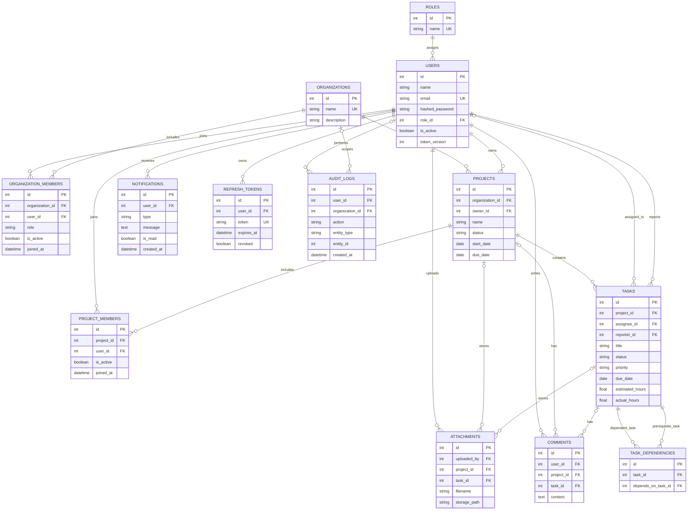

# Entity Relationship Diagram

This diagram reflects the SQLAlchemy models and database foreign keys in the current project.

```mermaid
erDiagram
    ROLES ||--o{ USERS : assigns

    USERS ||--o{ ORGANIZATION_MEMBERS : joins
    ORGANIZATIONS ||--o{ ORGANIZATION_MEMBERS : includes

    USERS ||--o{ PROJECT_MEMBERS : joins
    PROJECTS ||--o{ PROJECT_MEMBERS : includes

    ORGANIZATIONS ||--o{ PROJECTS : contains
    USERS ||--o{ PROJECTS : owns

    PROJECTS ||--o{ TASKS : contains
    USERS o|--o{ TASKS : assigned_to
    USERS ||--o{ TASKS : reports

    TASKS ||--o{ TASK_DEPENDENCIES : dependent_task
    TASKS ||--o{ TASK_DEPENDENCIES : prerequisite_task

    USERS ||--o{ COMMENTS : writes
    PROJECTS o|--o{ COMMENTS : has
    TASKS o|--o{ COMMENTS : has

    USERS ||--o{ ATTACHMENTS : uploads
    PROJECTS o|--o{ ATTACHMENTS : stores
    TASKS o|--o{ ATTACHMENTS : stores

    USERS ||--o{ NOTIFICATIONS : receives
    USERS ||--o{ REFRESH_TOKENS : owns

    USERS o|--o{ AUDIT_LOGS : performs
    ORGANIZATIONS o|--o{ AUDIT_LOGS : scopes

    ROLES {
        int id PK
        string name UK
    }

    USERS {
        int id PK
        string name
        string email UK
        string hashed_password
        int role_id FK
        boolean is_active
        int token_version
    }

    ORGANIZATIONS {
        int id PK
        string name UK
        string description
    }

    ORGANIZATION_MEMBERS {
        int id PK
        int organization_id FK
        int user_id FK
        string role
        boolean is_active
        datetime joined_at
    }

    PROJECTS {
        int id PK
        int organization_id FK
        int owner_id FK
        string name
        string status
        date start_date
        date due_date
    }

    PROJECT_MEMBERS {
        int id PK
        int project_id FK
        int user_id FK
        boolean is_active
        datetime joined_at
    }

    TASKS {
        int id PK
        int project_id FK
        int assignee_id FK
        int reporter_id FK
        string title
        string status
        string priority
        date due_date
        float estimated_hours
        float actual_hours
    }

    TASK_DEPENDENCIES {
        int id PK
        int task_id FK
        int depends_on_task_id FK
    }

    COMMENTS {
        int id PK
        int user_id FK
        int project_id FK
        int task_id FK
        text content
    }

    ATTACHMENTS {
        int id PK
        int uploaded_by FK
        int project_id FK
        int task_id FK
        string filename
        string storage_path
    }

    NOTIFICATIONS {
        int id PK
        int user_id FK
        string type
        text message
        boolean is_read
        datetime created_at
    }

    REFRESH_TOKENS {
        int id PK
        int user_id FK
        string token UK
        datetime expires_at
        boolean revoked
    }

    AUDIT_LOGS {
        int id PK
        int user_id FK
        int organization_id FK
        string action
        string entity_type
        int entity_id
        datetime created_at
    }
```

