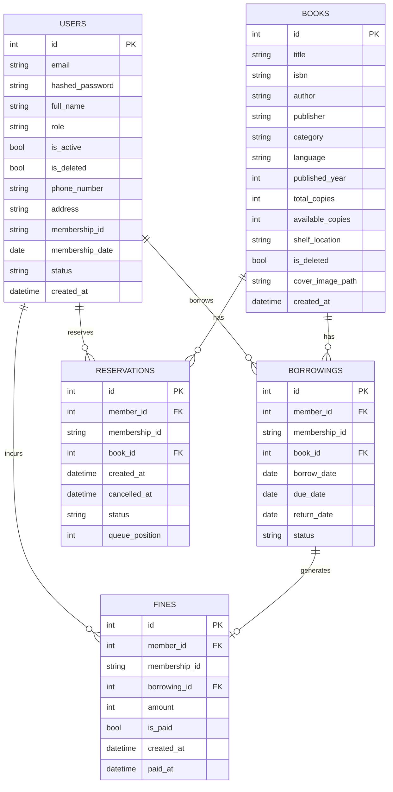

# Database Schema

```mermaid
erDiagram
    USERS ||--o{ BORROWINGS : borrows
    USERS ||--o{ RESERVATIONS : reserves
    USERS ||--o{ FINES : incurs
    BOOKS ||--o{ BORROWINGS : has
    BOOKS ||--o{ RESERVATIONS : has
    BORROWINGS ||--o| FINES : generates

    USERS {
        int id PK
        string email
        string hashed_password
        string full_name
        string role
        bool is_active
        bool is_deleted
        string phone_number
        string address
        string membership_id
        date membership_date
        string status
        datetime created_at
    }

    BOOKS {
        int id PK
        string title
        string isbn
        string author
        string publisher
        string category
        string language
        int published_year
        int total_copies
        int available_copies
        string shelf_location
        bool is_deleted
        string cover_image_path
        datetime created_at
    }

    BORROWINGS {
        int id PK
        int member_id FK
        string membership_id
        int book_id FK
        date borrow_date
        date due_date
        date return_date
        string status
    }

    RESERVATIONS {
        int id PK
        int member_id FK
        string membership_id
        int book_id FK
        datetime created_at
        datetime cancelled_at
        string status
        int queue_position
    }

    FINES {
        int id PK
        int member_id FK
        string membership_id
        int borrowing_id FK
        int amount
        bool is_paid
        datetime created_at
        datetime paid_at
    }
```

## Additional Notes
- The project creates a `reservations_ordered` view for consistent reservation ordering.
