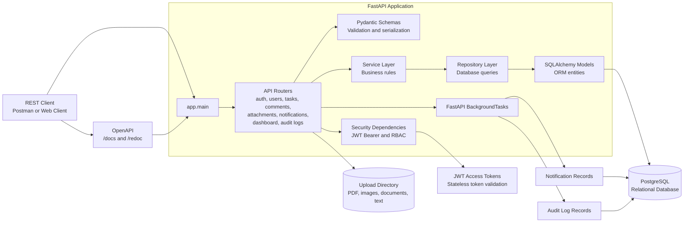
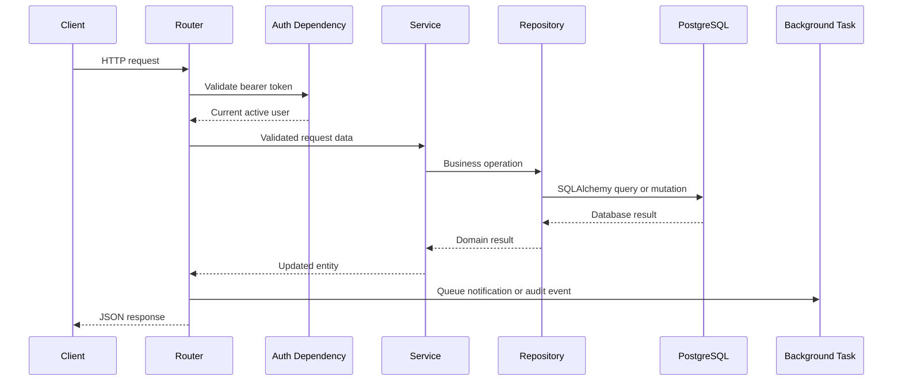

## Application architecture


```mermaid
flowchart LR
    Client[REST Client<br/>Postman or Web Client]
    Docs[OpenAPI<br/>/docs and /redoc]

    subgraph API[FastAPI Application]
        Main[app.main]
        Routers[API Routers<br/>auth, users, tasks, comments,<br/>attachments, notifications,<br/>dashboard, audit logs]
        Schemas[Pydantic Schemas<br/>Validation and serialization]
        Dependencies[Security Dependencies<br/>JWT Bearer and RBAC]
        Services[Service Layer<br/>Business rules]
        Repositories[Repository Layer<br/>Database queries]
        Models[SQLAlchemy Models<br/>ORM entities]
        Background[FastAPI BackgroundTasks]
    end

    Database[(PostgreSQL<br/>Relational Database)]
    Storage[(Upload Directory<br/>PDF, images, documents, text)]
    Notifications[Notification Records]
    Audit[Audit Log Records]

    Client --> Main
    Client --> Docs
    Docs --> Main
    Main --> Routers
    Routers --> Schemas
    Routers --> Dependencies
    Dependencies --> JWT[JWT Access Tokens<br/>Stateless token validation]
    Routers --> Services
    Services --> Repositories
    Repositories --> Models
    Models --> Database
    Routers --> Storage
    Routers --> Background
    Background --> Notifications
    Background --> Audit
    Notifications --> Database
    Audit --> Database
```

## Request flow


```mermaid
sequenceDiagram
    participant C as Client
    participant R as Router
    participant A as Auth Dependency
    participant S as Service
    participant Q as Repository
    participant D as PostgreSQL
    participant B as Background Task

    C->>R: HTTP request
    R->>A: Validate bearer token
    A-->>R: Current active user
    R->>S: Validated request data
    S->>Q: Business operation
    Q->>D: SQLAlchemy query or mutation
    D-->>Q: Database result
    Q-->>S: Domain result
    S-->>R: Updated entity
    R->>B: Queue notification or audit event
    R-->>C: JSON response
```


```

See [DATABASE_SCHEMA.md](DATABASE_SCHEMA.md) for the entity-relationship diagram and table details.
