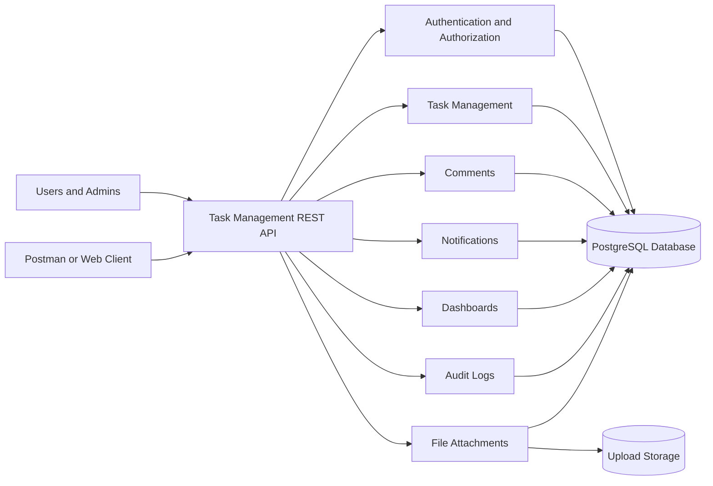

# Architecture Diagram

```mermaid
flowchart LR
    User[Users and Admins] --> API[Task Management REST API]
    Client[Postman or Web Client] --> API

    API --> Auth[Authentication and Authorization]
    API --> Tasks[Task Management]
    API --> Comments[Comments]
    API --> Files[File Attachments]
    API --> Notifications[Notifications]
    API --> Dashboards[Dashboards]
    API --> Audit[Audit Logs]

    Auth --> Database[(PostgreSQL Database)]
    Tasks --> Database
    Comments --> Database
    Notifications --> Database
    Dashboards --> Database
    Audit --> Database
    Files --> Database
    Files --> Storage[(Upload Storage)]
```
