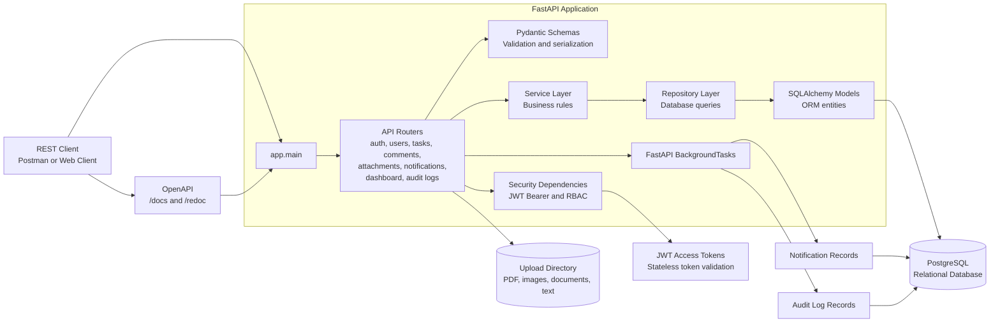
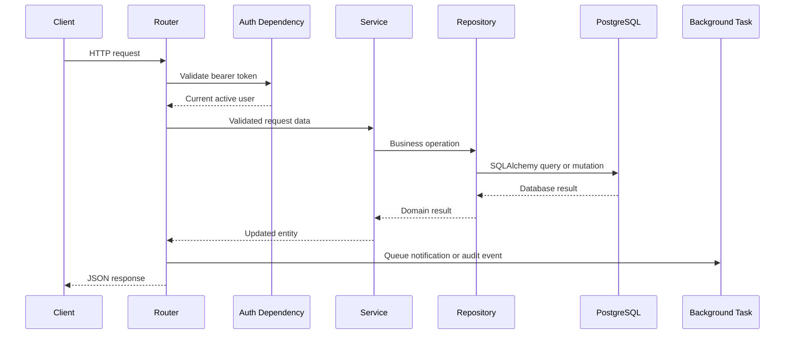

# System Architecture

## Application architecture



## Request flow



## Layer responsibilities

| Layer | Location | Responsibility |
|---|---|---|
| Application entry point | `app/main.py` | Creates the FastAPI app and registers routers |
| Routers | `app/routers/` | Defines HTTP endpoints, dependencies, status codes, and response handling |
| Schemas | `app/schemas/` | Validates request bodies and serializes responses with Pydantic |
| Core security | `app/core/` | Hashes passwords, creates and validates JWT access tokens, and enforces roles |
| Services | `app/services/` | Applies task, user, comment, notification, and authentication business rules |
| Repositories | `app/repositories/` | Encapsulates SQLAlchemy queries and persistence operations |
| Models | `app/models/` | Defines database tables and relationships with SQLAlchemy |
| Database | `app/database.py` | Creates the SQLAlchemy engine, session factory, and database dependency |
| File storage | `uploads/` | Stores uploaded attachment files; metadata is stored in the database |
| Migrations | `alembic/` | Versioned database schema changes |

## Authentication and authorization

1. A user registers or logs in through the authentication router.
2. The server returns a signed JWT access token.
3. Protected requests send the token using `Authorization: Bearer <token>`.
4. The security dependency validates the token and loads the active user.
5. Role-based dependencies restrict admin-only endpoints.
6. There is no refresh-token endpoint or token database table.

## Task ownership model

- Any authenticated active user can create a task.
- `created_by_id` identifies the task creator.
- `assigned_to_id` identifies the current assignee and may be empty.
- Only the creator or an admin can assign or reassign a task.
- The creator, current assignee, or an admin can access a task.
- The assigned user can change only task status and priority.
- Task details, assignment, status, and priority use separate API operations.

## Event processing

Task assignment, reassignment, status changes, comments, and completion create notification records through FastAPI background tasks. Important user actions also create audit-log records. Both records are persisted in PostgreSQL.

## Database and migrations

SQLAlchemy models define the relational entities, while Alembic migrations are the source of truth for deployed schema changes.

```powershell
python -m alembic upgrade head
```

See [DATABASE_SCHEMA.md](DATABASE_SCHEMA.md) for the entity-relationship diagram and table details.
