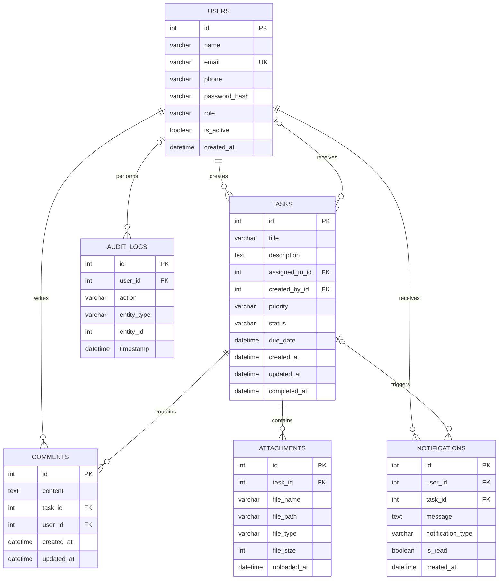

# Database Schema

```mermaid
erDiagram
    USERS ||--o{ TASKS : creates
    USERS o|--o{ TASKS : receives
    USERS ||--o{ COMMENTS : writes
    TASKS ||--o{ COMMENTS : contains
    TASKS ||--o{ ATTACHMENTS : contains
    USERS ||--o{ NOTIFICATIONS : receives
    TASKS o|--o{ NOTIFICATIONS : triggers
    USERS o|--o{ AUDIT_LOGS : performs

    USERS {
        int id PK
        varchar name
        varchar email UK
        varchar phone
        varchar password_hash
        varchar role
        boolean is_active
        datetime created_at
    }

    TASKS {
        int id PK
        varchar title
        text description
        int assigned_to_id FK
        int created_by_id FK
        varchar priority
        varchar status
        datetime due_date
        datetime created_at
        datetime updated_at
        datetime completed_at
    }

    COMMENTS {
        int id PK
        text content
        int task_id FK
        int user_id FK
        datetime created_at
        datetime updated_at
    }

    ATTACHMENTS {
        int id PK
        int task_id FK
        varchar file_name
        varchar file_path
        varchar file_type
        int file_size
        datetime uploaded_at
    }

    NOTIFICATIONS {
        int id PK
        int user_id FK
        int task_id FK
        text message
        varchar notification_type
        boolean is_read
        datetime created_at
    }

    AUDIT_LOGS {
        int id PK
        int user_id FK
        varchar action
        varchar entity_type
        int entity_id
        datetime timestamp
    }
```

