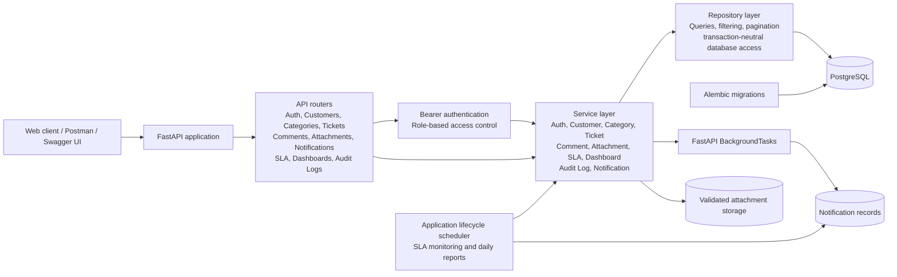

# System Architecture

The CRM backend uses a layered FastAPI architecture. HTTP concerns stay in routers, business rules live in individual service modules, and database access is isolated in repositories.



## Request Flow

```text
HTTP request
  -> FastAPI router
  -> Bearer-token authentication and role authorization
  -> Domain service
  -> Repository query or transaction
  -> PostgreSQL
  -> Pydantic response schema
  -> HTTP response
```

For example, ticket creation follows this flow:

```text
POST /tickets
  -> authenticate current user
  -> TicketService validates customer and category
  -> load priority SLA policy
  -> create ticket and SLA deadlines
  -> write audit log
  -> commit transaction
  -> queue notifications
  -> return ticket response
```

## Main Layers

### API routers

Routers define the public REST API and handle:

- HTTP methods and paths
- Request parsing
- Dependency injection
- Role restrictions
- Response schemas
- HTTP status codes

### Security and dependencies

The security layer validates bearer JWTs, loads the current user, rejects inactive users, and enforces admin, support-agent, and customer permissions.

### Service layer

Services implement business rules:

- `auth.py`: registration, login, profile, and password changes
- `customer.py`: customer creation, updates, and deactivation
- `category.py`: category validation and uniqueness rules
- `ticket.py`: ticket creation, assignment, lifecycle, and ticket permissions
- `comment.py`: comment ownership and terminal-ticket rules
- `attachment.py`: file type, MIME type, size, and storage validation
- `sla.py`: SLA policies, deadlines, and status calculation
- `dashboard.py`: role-specific dashboard metrics
- `audit_log.py`: audit record creation
- `notification.py`: asynchronous notification persistence

### Repository layer

Repositories encapsulate SQLAlchemy queries for:

- Entity lookup
- Filtering and search
- Sorting
- Pagination
- Workload and ownership queries

Services own commits and transaction boundaries.

### Database and migrations

PostgreSQL stores users, customers, categories, tickets, comments, attachments, notifications, SLA policies, and audit logs. Alembic manages schema changes and compatibility migrations.

### Background processing

FastAPI `BackgroundTasks` persists notifications after successful API transactions. The PostgreSQL application lifecycle also runs periodic SLA monitoring and daily support reports. A durable queue such as Celery or RQ can replace this adapter for larger deployments.

### File storage

Attachments are validated before storage. Files are stored under the configured upload directory in ticket-specific folders, while attachment metadata is stored in PostgreSQL.

## Scalability Characteristics

- Stateless JWT-authenticated API workers
- PostgreSQL indexes for common filters and ownership queries
- Server-side pagination for large collections
- Repository boundary suitable for caching or read replicas
- Background processing outside the main notification request path
- File storage separated from database metadata
- Alembic migrations for repeatable deployments
